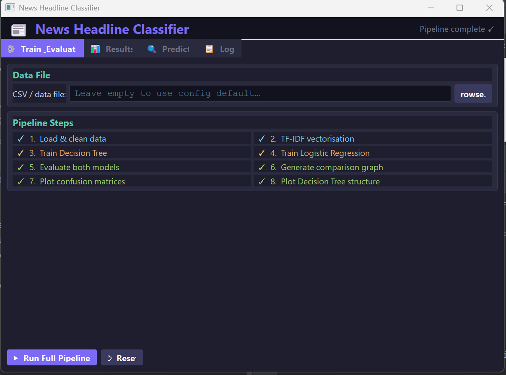
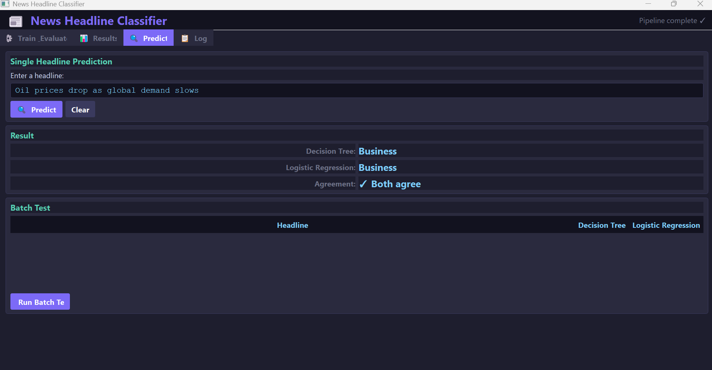
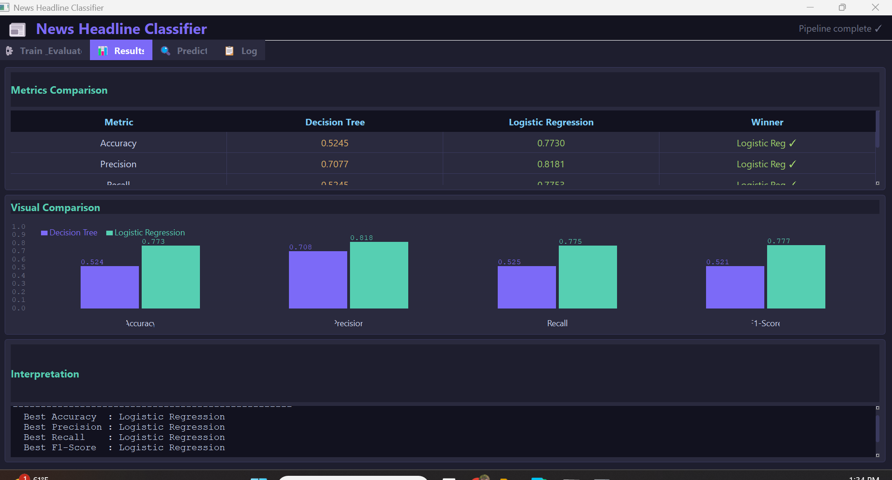
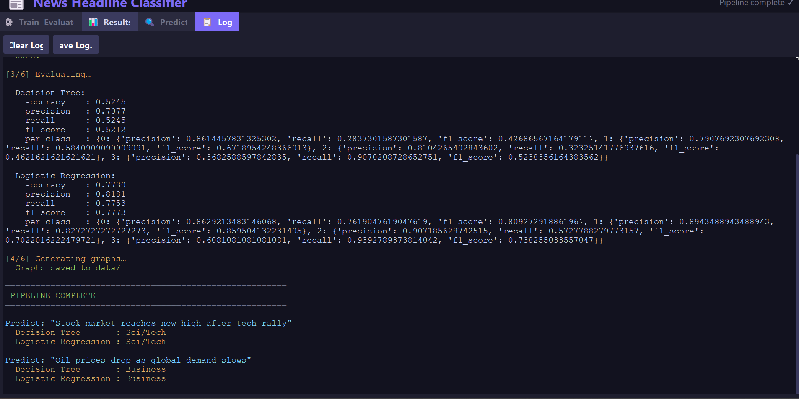

# News Headline Classifier

A Machine Learning application that classifies news headlines into categories using **TF-IDF vectorization** with two classification models:

- Decision Tree
- Logistic Regression

The system includes a **Graphical User Interface (GUI)** that allows users to train models, evaluate results, visualize metrics, and predict news categories.

---

# Features

- Text preprocessing and cleaning
- TF-IDF feature extraction
- Decision Tree classifier
- Logistic Regression classifier
- Accuracy, Precision, Recall, and F1 evaluation
- Confusion Matrix visualization
- Model comparison graphs
- Interactive GUI interface
- Single headline prediction
- Batch testing support

---

# Project Architecture

Text Input
↓
Text Cleaning
↓
TF-IDF Vectorization
↓
Model Training
├── Decision Tree
└── Logistic Regression
↓
Evaluation Metrics
↓
Visualization

---

# GUI Overview

## Training Pipeline

## Prediction Interface

## Model Results

## System Logs

---

# Models Used

## Decision Tree
A tree-based classifier that splits data based on feature importance.

Pros:
- Easy to interpret
- Fast training

Cons:
- Prone to overfitting

---

## Logistic Regression

A linear classifier that predicts probabilities using the logistic function.

Pros:
- Good generalization
- Works well with TF-IDF features

Cons:
- Less interpretable than trees

---

# Evaluation Metrics

The models are evaluated using:

- Accuracy
- Precision
- Recall
- F1 Score

Example results from the experiment:

| Metric | Decision Tree | Logistic Regression |
|------|------|------|
| Accuracy | 0.524 | 0.773 |
| Precision | 0.707 | 0.818 |
| Recall | 0.524 | 0.775 |
| F1 Score | 0.521 | 0.777 |

Best performing model: **Logistic Regression**

---

# Dataset

The project uses the **AG News Dataset**, containing news headlines categorized into:

- World
- Sports
- Business
- Sci/Tech

---

# Installation

Clone the repository:

git clone https://github.com/yourusername/news-headline-classifier.git

Move into the project:

cd news-headline-classifier

Install dependencies:

pip install -r requirements.txt

---

# Running the Application

Run the GUI:

python main_gui.py

Run the pipeline via terminal:

python main.py

---

# Project Structure

classifier/
models/
utils/
data/
main.py
main_gui.py
config.py

---

# Technologies Used

- Python
- Scikit-Learn
- Pandas
- Numpy
- Matplotlib
- Tkinter / PyQt (GUI)

---

# Author

Tareq Ladadweh  
Computer Science Student  
Birzeit University
